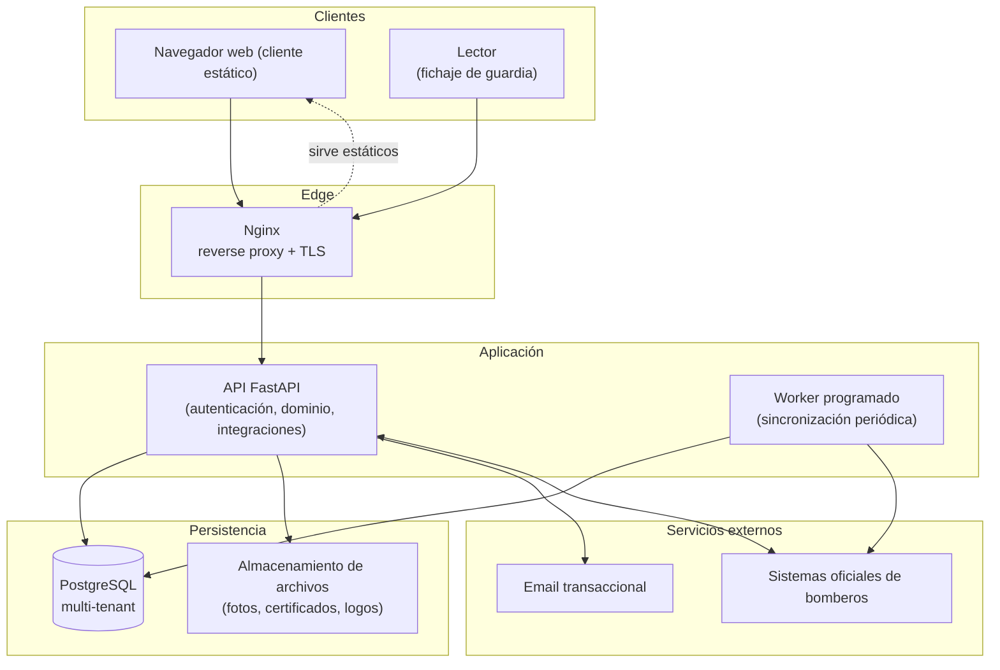
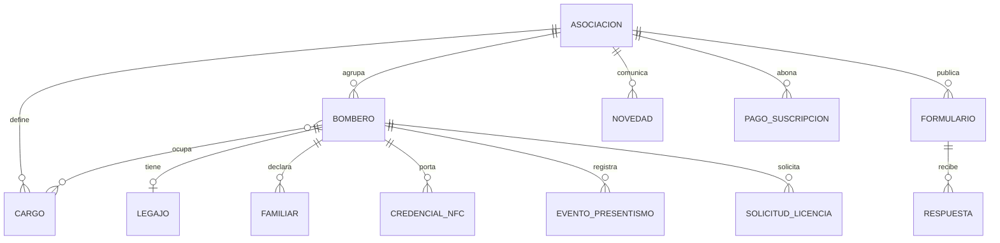

<p align="center">
  
</p>

<h1 align="center">BOMBEROS.AR</h1>

<p align="center">
  <em>Plataforma SaaS multi-tenant para la gestión de personal y operaciones de cuarteles de bomberos.</em>
</p>

<p align="center">
  
  
  
  
</p>


---

## El problema

Los cuarteles de bomberos voluntarios en Argentina gestionan su personal con
herramientas dispersas: planillas de Excel, grupos de WhatsApp, cuadernos de
guardia en papel y cargas manuales repetidas contra los sistemas oficiales de
gestión de bomberos. Esto genera doble carga de datos, errores, falta de
trazabilidad y horas administrativas que podrían dedicarse a la operación.

**BOMBEROS.AR** centraliza esa gestión en una sola plataforma: cada cuartel
(asociación) opera como un *tenant* aislado, con su propio personal, escalafón,
control de presentismo, licencias, comunicaciones internas y reportería — y con
sincronización automática hacia los sistemas oficiales para eliminar la doble
carga.

---

## Stack tecnológico

| Capa | Tecnología |
|------|-----------|
| **Backend / API** | Python 3.12, [FastAPI](https://fastapi.tiangolo.com/), Uvicorn, Pydantic v2 |
| **Base de datos** | PostgreSQL 16 (extensiones `uuid-ossp`, `citext`) |
| **Acceso a datos** | SQLAlchemy Core (consultas SQL parametrizadas); esquema versionado con scripts de migración ordenados |
| **Autenticación** | JWT (firma HS256), bcrypt para hashing de contraseñas, OTP/2FA con `pyotp` |
| **Procesamiento de datos** | pandas, openpyxl (import/export de planillas) |
| **Reportería** | Jinja2 (plantillas HTML), `pdf2image` |
| **Integraciones externas** | Capa de sincronización propia con sistemas oficiales; email transaccional vía SMTP y API de terceros |
| **Frontend** | HTML/CSS/JavaScript vanilla (sin framework), servido como sitio estático |
| **Hardware** | Lectores basados para fichaje de presentismo |
| **Infraestructura** | Docker Compose, Nginx como reverse proxy con terminación TLS |

> La elección de JS vanilla en el frontend es intencional: el cliente principal
> es una UI de formularios y tablas con requisitos de carga bajos, y evitar un
> framework reduce la superficie de mantenimiento y lleva el tiempo de build a cero.

---

## Arquitectura general



Cada componente corre como un contenedor independiente orquestado con Docker
Compose. El worker de sincronización se separa de la API para que las cargas
largas no afecten la latencia de las peticiones interactivas.

---

## Modelo de datos (conceptual)

El núcleo del modelo gira alrededor del **aislamiento por tenant**: casi toda
entidad pertenece a una **Asociación** (un cuartel), y las restricciones de
unicidad están acotadas por asociación (por ejemplo, un documento de identidad es
único *dentro* de un cuartel, no globalmente).



Entidades principales (a alto nivel):

- **Asociación** — el tenant. Representa un cuartel con sus datos institucionales.
- **Bombero (Usuario)** — la persona. Combina credenciales de acceso con un
  perfil personal y un perfil operativo "bomberil" (jerarquía, habilitaciones,
  destacamento, etc.).
- **Legajo** — información de perfil extendida del bombero.
- **Cargo** — catálogo de cargos/jerarquías por asociación; relación N:M con bomberos.
- **Credencial NFC** — tarjeta física asociada a un bombero para el fichaje.
- **Evento de presentismo** — registro de entrada/salida de guardia, con la
  duración derivada y el origen del registro.
- **Formulario / Respuesta** — formularios configurables por asociación. Los
  formularios son **inmutables una vez creados** (ver decisiones técnicas).
- **Solicitud de licencia** — flujo de pedido y aprobación de licencias.
- **Novedad / Notificación** — comunicaciones internas del cuartel.
- **Pago de suscripción** — estado comercial del tenant.

> El esquema completo, con columnas, constraints y triggers, no se documenta acá
> a propósito.

---

## Decisiones técnicas destacables

### Multi-tenancy a nivel de base de datos (shared-schema)
Todos los cuarteles comparten una misma base, y el aislamiento se garantiza por
una clave de tenant presente en cada entidad, con restricciones de unicidad
acotadas por tenant. Se eligió este enfoque sobre "una base por cliente" porque
los cuarteles son entidades de tamaño acotado y similar: el modelo compartido
simplifica drásticamente las migraciones, el backup y la operación, mientras que
una base por tenant habría multiplicado el costo operativo sin un beneficio real
de aislamiento para este caso de uso.

### Esquema SQL versionado, SQLAlchemy Core en vez de ORM
El esquema se administra con scripts de migración numerados y aplicados en orden,
y el acceso a datos usa SQLAlchemy Core con SQL parametrizado en lugar de un ORM
con modelos. Para un dominio donde las consultas analíticas (reportes,
agregaciones de horas, auditorías) son de primera clase, escribir SQL explícito
da control fino sobre el rendimiento y evita la opacidad del ORM, a costa de algo
más de verbosidad.

### Formularios inmutables
Una vez creado, un formulario no puede modificarse: solo puede marcarse como
vigente o no vigente. Esta invariante se protege en la propia base de datos.
El motivo es de **trazabilidad**: las respuestas históricas deben seguir
correspondiendo exactamente al formulario que el bombero vio y completó en su
momento. Editar un formulario en lugar de versionarlo corrompería ese registro.

### Sincronización con los sistemas oficiales
La doble carga contra los sistemas oficiales era uno de los principales dolores
del usuario. La plataforma modela esa integración como una capa de sincronización
que traduce los datos internos al formato del sistema externo y los empuja de
forma automática y programada, en vez de manual. Se ejecuta en un worker separado
de la API para no impactar la experiencia interactiva. Los detalles del protocolo
de integración no son públicos.

### Presentismo por hardware NFC
El fichaje de guardia se hace con lectores NFC dedicados: el bombero
acerca su credencial y queda registrada la entrada/salida. El backend valida y
deriva la duración de cada turno, descartando registros inconsistentes (turnos
sin salida, duraciones imposibles, etc.). Esto reemplaza el cuaderno de guardia
en papel y produce datos limpios para reportería y para la sincronización oficial.

### Endurecimiento básico
La documentación interactiva de la API (Swagger/OpenAPI) está deshabilitada fuera
de entornos de desarrollo, los secretos se inyectan por variables de entorno
(nunca versionados), y la autenticación soporta segundo factor (OTP).

---

## Funcionalidades principales

Descritas por **capacidad**, no por implementación:

- **Acceso y seguridad** — inicio de sesión con JWT, segundo factor opcional
  (OTP), recuperación de contraseña por email y permisos derivados por rol.
- **Gestión de personal** — alta y administración de bomberos, perfil personal y
  operativo, legajo, familiares y foto.
- **Escalafón y cargos** — catálogo de jerarquías por cuartel y asignación a cada
  bombero.
- **Presentismo y guardia** — fichaje por NFC, tablero de presentes en tiempo
  real, cómputo de cumplimiento mensual de horas y auditoría.
- **Licencias** — solicitud por parte del bombero y flujo de aprobación/rechazo.
- **Sincronización oficial** — carga automática de datos y presentismo hacia los
  sistemas oficiales, eliminando la doble carga.
- **Comunicaciones** — novedades internas con comentarios y reacciones, más
  notificaciones in-app y por email.
- **Documentos** — carga y consulta de certificados de cursos y constancias.
- **Reportería** — tableros de estadísticas y generación de informes
  (mensuales/anuales) con filtros.
- **Administración del cuartel** — gestión de usuarios, roles y configuración del
  tenant.
- **Gestión comercial** — seguimiento del estado de suscripción de cada cuartel.

---

## Estructura del repositorio (vista general)

```
backend/        API FastAPI (módulos por dominio) + capa de sincronización
  app/          autenticación, usuarios, presentismo, licencias, reportes, ...
db/init/        esquema versionado (scripts de migración ordenados)
frontend/       cliente estático (HTML/CSS/JS)
web/            configuración de Nginx (reverse proxy + TLS)
storage/        archivos servidos (logos, fotos, certificados)
docs/           documentación técnica interna
docker-compose.yml   orquestación de servicios
```

---

## Estado y contexto

Proyecto en producción, dando servicio a cuarteles reales. Este README refleja el
sistema a nivel arquitectónico; el código de detalle, la configuración de
producción y la lógica de negocio sensible se mantienen fuera de la vista pública.

<p align="center"><sub>BOMBEROS.AR — marca registrada. Todos los derechos reservados.</sub></p>
